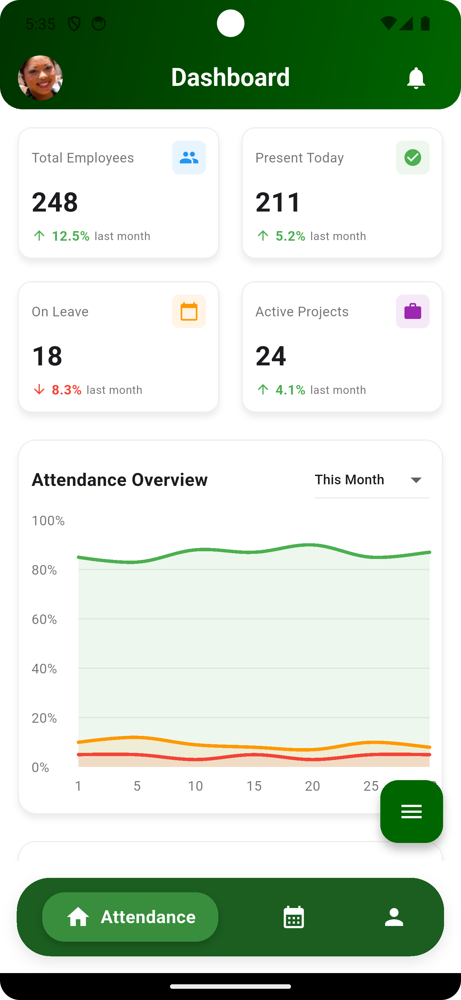
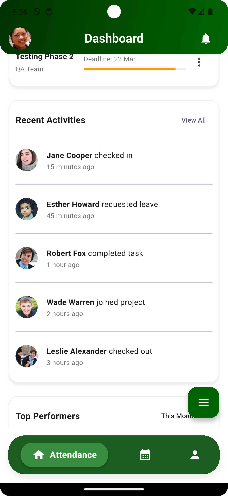
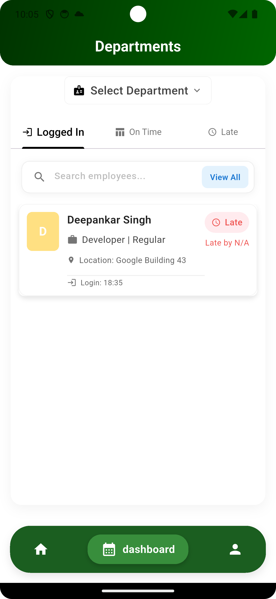
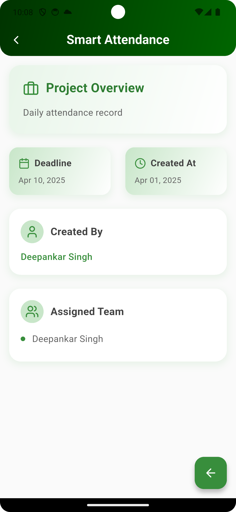
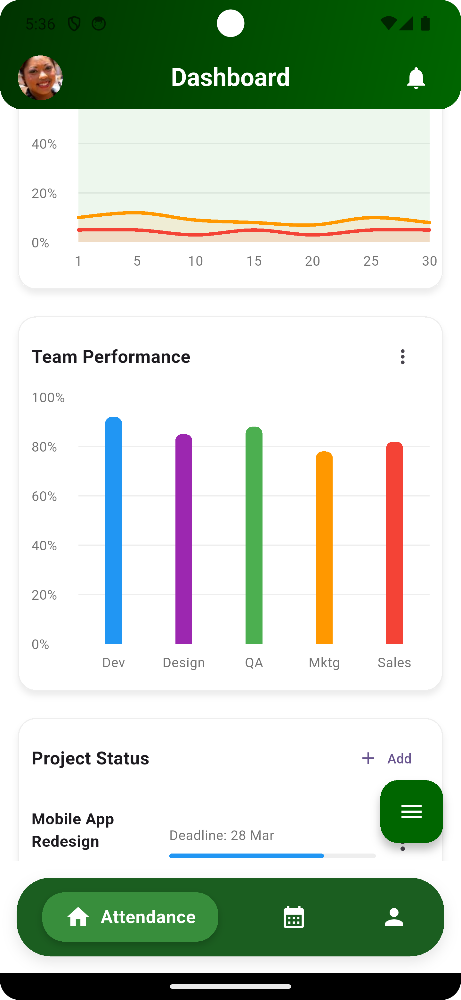
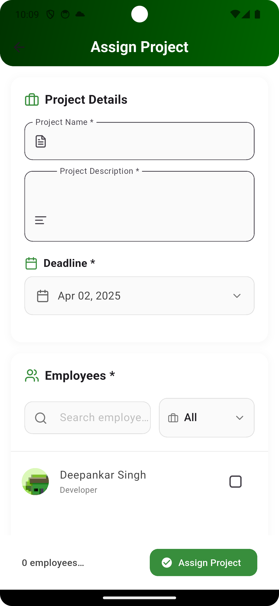

# 📱 Smart Attendance System

<div align="center">


A modern, location-based attendance management system built with Flutter and Firebase.

[](https://flutter.dev/)
[](https://firebase.google.com/)
[](LICENSE)

</div>

## ✨ Features

### 🎯 For Students
- **Biometric Authentication** - Secure login with fingerprint/face recognition
- **Location-Based Check-in/out** - Geofenced attendance marking
- **Real-time Status** - Instant feedback on attendance status (On Time/Late)
- **Attendance History** - View past attendance records with detailed statistics
- **Profile Management** - Update personal information and view attendance analytics

### 👨‍🏫 For Teachers/Admins
- **Department Management** - Organize students by departments
- **Real-time Monitoring** - Track student attendance in real-time
- **Attendance Analytics** - Comprehensive dashboard with attendance statistics
- **Custom Office Hours** - Set flexible check-in/out times
- **Export Reports** - Generate and download attendance reports

## 🛠️ Technical Features

- **Firebase Integration**
  - Real-time Database
  - Authentication
  - Cloud Firestore
  - Crashlytics
- **Location Services**
  - Geolocation
  - Geocoding
  - Permission handling
- **Modern UI/UX**
  - Material Design
  - Animated transitions
  - Responsive layouts
  - Custom charts and analytics
- **Security**
  - Biometric authentication
  - Location verification
  - Role-based access control

## 📱 Screenshots

<div align="center">
<table>
  <tr>
    <td></td>
    <td></td>
    <td></td>
  </tr>
  <tr>
    <td></td>
    <td></td>
    <td></td>
  </tr>
</table>
</div>

## 🚀 Getting Started

### Prerequisites
- Flutter SDK (^3.6.2)
- Dart SDK
- Firebase account
- Android Studio / VS Code
- Git

### Installation

1. Clone the repository
```bash
git clone https://github.com/yourusername/smartt_attendance.git
```

2. Navigate to project directory
```bash
cd smartt_attendance
```

3. Install dependencies
```bash
flutter pub get
```

4. Configure Firebase
- Create a new Firebase project
- Add Android/iOS apps in Firebase console
- Download and add configuration files
- Enable Authentication and Firestore

5. Run the app
```bash
flutter run
```

## 🏗️ Project Structure

```
lib/
├── admin screen/      # Admin-specific screens
├── student screen/    # Student-specific screens
├── models/           # Data models
├── provider/         # State management
├── services/         # Firebase and other services
├── utils/           # Utility functions
└── main.dart        # Entry point
```

## 🔧 Configuration

### Environment Variables
Create a `.env` file in the root directory:
```env
FIREBASE_API_KEY=your_api_key
FIREBASE_PROJECT_ID=your_project_id
```

### Firebase Setup
1. Enable Authentication methods
2. Set up Firestore rules
3. Configure Firebase storage
4. Set up Firebase Functions (if needed)

## 📚 Dependencies

Key packages used in this project:
- `firebase_core`, `cloud_firestore`, `firebase_auth` - Firebase integration
- `geolocator`, `geocoding` - Location services
- `provider` - State management
- `local_auth` - Biometric authentication
- `fl_chart` - Beautiful charts
- View `pubspec.yaml` for complete list

## 🤝 Contributing

1. Fork the repository
2. Create your feature branch (`git checkout -b feature/AmazingFeature`)
3. Commit your changes (`git commit -m 'Add some AmazingFeature'`)
4. Push to the branch (`git push origin feature/AmazingFeature`)
5. Open a Pull Request

## 📄 License

This project is licensed under the MIT License - see the [LICENSE](LICENSE) file for details.

## 👥 Authors

- **Your Name** - *Initial work* - [YourGithub](https://github.com/yourusername)

## 🙏 Acknowledgments

- Flutter team for the amazing framework
- Firebase for the robust backend services
- All contributors who have helped this project grow

---

<div align="center">
Made with ❤️ by [Your Name/Team]
</div>
